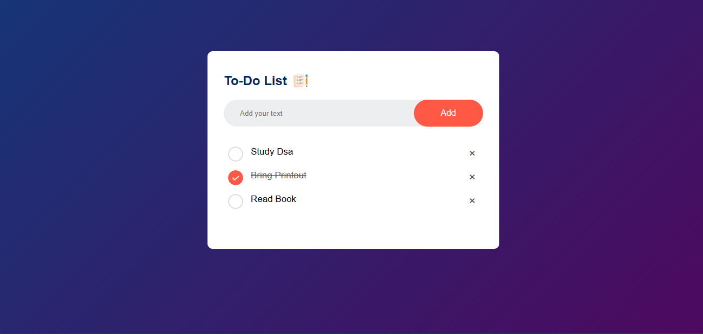

# 📝 Simple To-Do List App

This is a basic yet functional To-Do List web application built using HTML, CSS, and JavaScript.  
It allows users to add tasks, mark them as completed, delete tasks, and automatically saves the list using `localStorage`, so tasks stay even after refreshing the page.

---

## 🚀 Features

- ✅ Add new tasks
- ✔️ Mark tasks as completed (toggle)
- ❌ Delete tasks using the × button
- 💾 Auto-save tasks in `localStorage`
- 🔁 Load tasks on page reload

---

## 💡 How It Works

- **Adding a task**: User types a task and presses enter or clicks the add button. It gets added to the DOM.
- **Completing a task**: Clicking on the task (`<li>`) toggles a `checked` class (often styled with line-through).
- **Deleting a task**: Clicking on the "×" `` removes the task's parent `<li>`.
- **Saving**: After every add/delete/toggle, the task list is saved in `localStorage` using `listContainer.innerHTML`.
- **Restoring**: On page load, `showTask()` restores saved HTML content from `localStorage`.

---

## 🧱 Code Structure

### JavaScript Functions

- `saveData()`: Saves task list HTML to `localStorage`.
- `showTask()`: Loads and displays saved task list from `localStorage`.
- `listContainer.addEventListener(...)`: Handles task completion and deletion using event delegation.

---

## 🛠 Technologies Used

- **HTML**
- **CSS**
- **JavaScript (Vanilla)**
- **localStorage API**

---

## 📷 Screenshot

---
 

